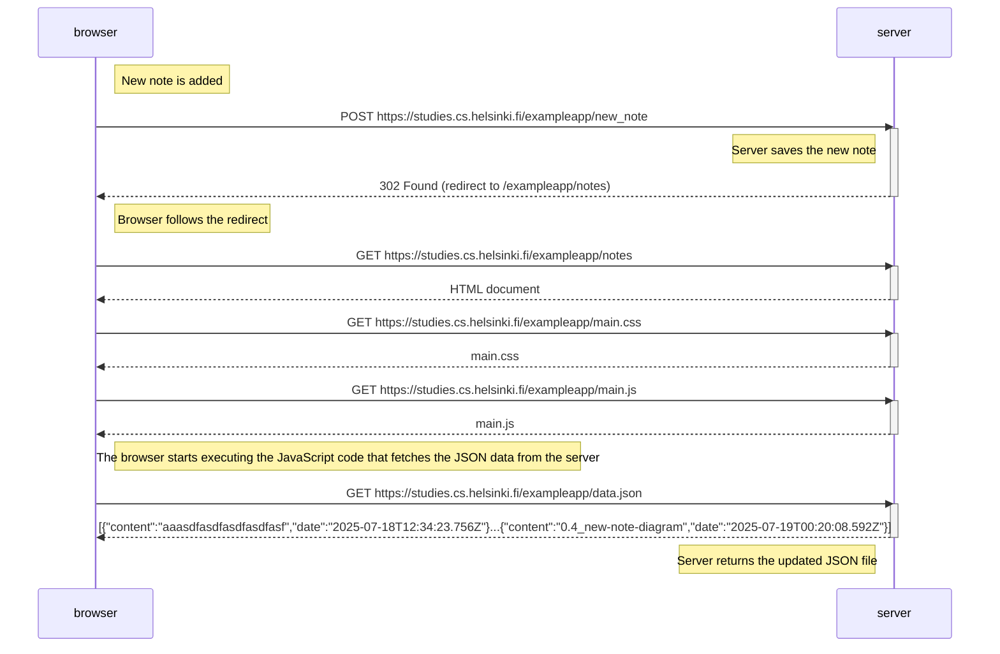

# New note diagram

```mermaid
sequenceDiagram
    participant browser
    participant server

    Note right of browser: New note is added

    browser->>server: POST https://studies.cs.helsinki.fi/exampleapp/new_note
    activate server
    Note left of server: Server saves the new note
    server-->>browser: 302 Found (redirect to /exampleapp/notes)
    deactivate server

    Note right of browser: Browser follows the redirect

    browser->>server: GET https://studies.cs.helsinki.fi/exampleapp/notes
    activate server
    server-->>browser: HTML document
    deactivate server

    browser->>server: GET https://studies.cs.helsinki.fi/exampleapp/main.css
    activate server
    server-->>browser: main.css
    deactivate server

    browser->>server: GET https://studies.cs.helsinki.fi/exampleapp/main.js
    activate server
    server-->>browser: main.js
    deactivate server

    Note right of browser: The browser starts executing the JavaScript code that fetches the JSON data from the server

    browser->>server: GET https://studies.cs.helsinki.fi/exampleapp/data.json
    activate server
    server-->>browser: [{"content":"aaasdfasdfasdfasdfasf","date":"2025-07-18T12:34:23.756Z"}...{"content":"0.4_new-note-diagram","date":"2025-07-19T00:20:08.592Z"}]
    deactivate server
    Note left of server: Server returns the updated JSON file
```
