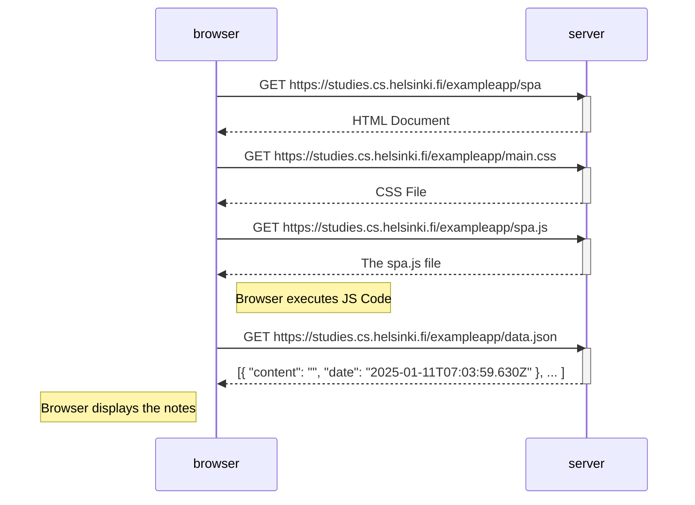

```mermaid
    sequenceDiagram
        participant browser
        participant server
        
        browser->>server: GET https://studies.cs.helsinki.fi/exampleapp/spa
        activate server
        server-->>browser: HTML Document
        deactivate server
        
        browser->>server: GET https://studies.cs.helsinki.fi/exampleapp/main.css
        activate server
        server-->>browser: CSS File
        deactivate server
        
        browser->>server: GET https://studies.cs.helsinki.fi/exampleapp/spa.js
        activate server
        server-->>browser: The spa.js file
        deactivate server
        
        Note right of browser: Browser executes JS Code
        
        browser->>server: GET https://studies.cs.helsinki.fi/exampleapp/data.json
        activate server
        server-->>browser: [{ "content": "", "date": "2025-01-11T07:03:59.630Z" }, ... ]
        deactivate server
    
        Note left of browser: Browser displays the notes
```
